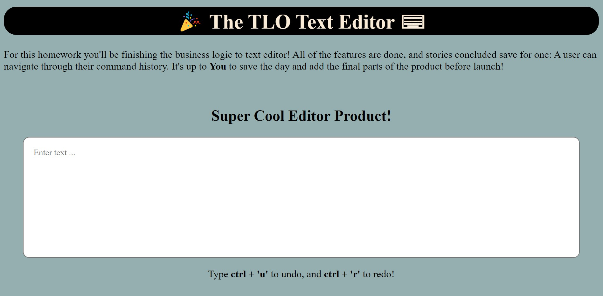

# Text Editor from Stack

- created with HTML, CSS, and JavaScript
- uses the JavaScript stack data structure and DOM to add, undo, and redo data

[The TLO Text Editor](https://lucid-kowalevski-47fd22.netlify.app/)
